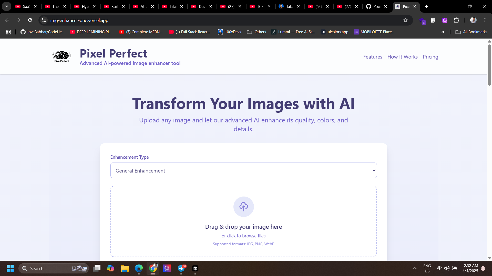
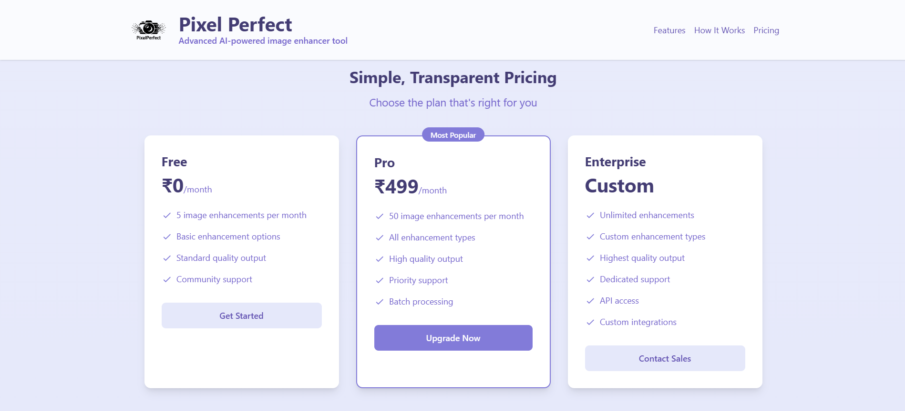

# Image Enhancer

A powerful web application that enhances images using AI technology. Transform your photos with advanced enhancement features, real-time previews, and professional-grade results.

## 🌟 Features

- **Multiple Enhancement Types**
  - Portrait Enhancement
  - Landscape Enhancement
  - Low Light Enhancement
- **Real-time Preview**
- **Responsive Design**
- **Subscription Plans**
  - Free: 5 enhancements/month
  - Pro: 50 enhancements/month (₹499/month)
  - Enterprise: Custom solutions

## 🖥️ Website Preview

### Home Page

- Modern, clean interface with gradient background
- Sticky header with navigation
- Hero section with clear value proposition
- Feature highlights with icons
- Responsive design for all devices

### Pricing Page

- Three-tier pricing structure
- Clear feature comparison
- Popular plan highlight
- INR currency formatting
- Call-to-action buttons


## 🛠️ Technology Stack

### Frontend
- React 18
- Vite
- Tailwind CSS
- Axios
- React Router DOM
- React Dropzone

### Future Backend
- Node.js/Express
- Python
- TensorFlow/PyTorch
- MongoDB/PostgreSQL

## 🚀 Getting Started

### Prerequisites
- Node.js (v14 or higher)
- npm or yarn
- Git

### Installation
1. Clone the repository
```bash
git clone https://github.com/yourusername/img-enhancer.git
cd img-enhancer
```

2. Install dependencies
```bash
cd frontend
npm install
```

3. Start the development server
```bash
npm run dev
```

## 🔮 Future Work

### Phase 1: Research & Development
- Evaluate existing AI models for image enhancement
- Identify key areas for improvement
- Design architecture for in-house solution

### Phase 2: Model Development
- Train base model on high-quality image pairs
- Implement core enhancement algorithms
- Develop model evaluation metrics

### Phase 3: Specialized Enhancement Types
- Portrait enhancement with facial feature preservation
- Landscape enhancement with color optimization
- Low-light enhancement with noise reduction

### Phase 4: Production Integration
- API development
- Performance optimization
- Scalability implementation

### Phase 5: Advanced Features
- Batch processing
- Custom enhancement presets
- API access for enterprise clients

## 🤝 Contributing

We welcome contributions! Please see our [Contributing Guidelines](CONTRIBUTING.md) for details.

## 📄 License

This project is licensed under the MIT License - see the [LICENSE](LICENSE) file for details.

## 🙏 Acknowledgments

- Open source community
- AI/ML research community
- Contributors and supporters